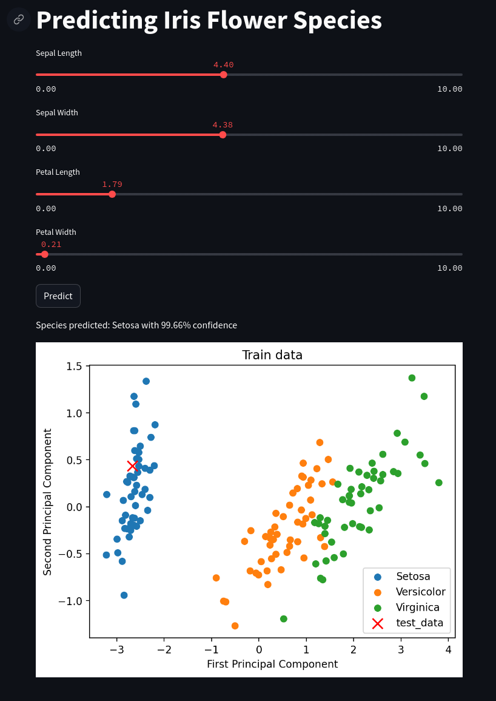

# FastAPI-Streamlit: Interactive web-app - EDA and classification model integration

This repository contains a comprehensive project that performs Exploratory Data Analysis (EDA) and classification tasks on the Iris dataset. The project utilizes FastAPI for creating a robust API endpoints, and Streamlit for building an interactive web application.

The goal of this project is to provide a hands-on approach to understanding data analysis and machine learning workflows while demonstrating the use of FastAPI and Streamlit in a practical context.

## Streamlit Multi-Page Functionality
The following links were used to implement the multi-page functionality in streamlit:
 - https://docs.streamlit.io/get-started/tutorials/create-a-multipage-app
 - https://docs.streamlit.io/library/advanced-features/multipage-apps


## Run Streamlit App
To run the streamlit app, first FastAPI app should be running. To run the FastAPI app, run the following command:

```
uvicorn main:app --reload
```
Once the FastAPI app is running, run the following command to run the streamlit app:
```
streamlit run app/Home.py
```

OR, you can run the app using `make` command:
```
make run_app
```
It will run both FastAPI and Streamlit apps, and open the streamlit app in the browser. 

## Cloud Deployment
This `streamlit` app is deployed on `streamlit` cloud. You can access the deployed app using the following link:

[Streamlit App](https://streamlifastapi.streamlit.app/)

## Classification Results
The classification results are displayed in the streamlit app on a separate page and look like the following:



## Requirements
requirements.yml file contains the list of all the packages required to run the code in this repository. requirements.yml is generated using the following command:

```
conda env export --no-builds | grep -v "prefix" > requirements.yml
```
To create a conda environment using the requirements.yml file, run the following command:

```
conda env create -f requirements.yml
```
